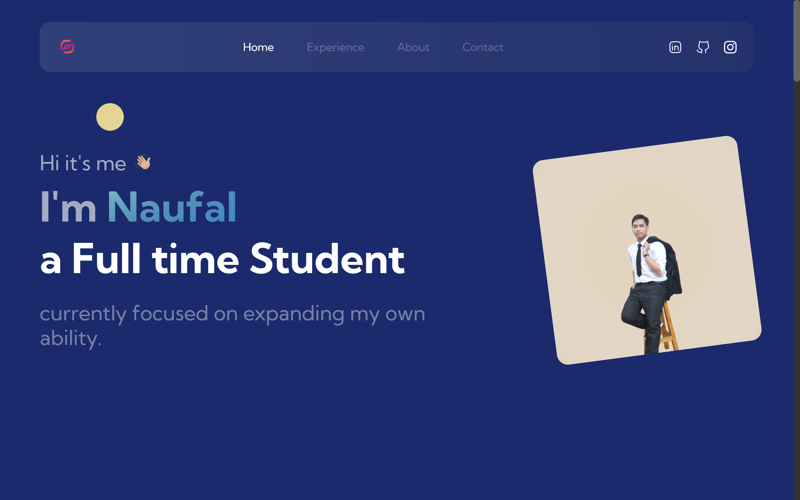
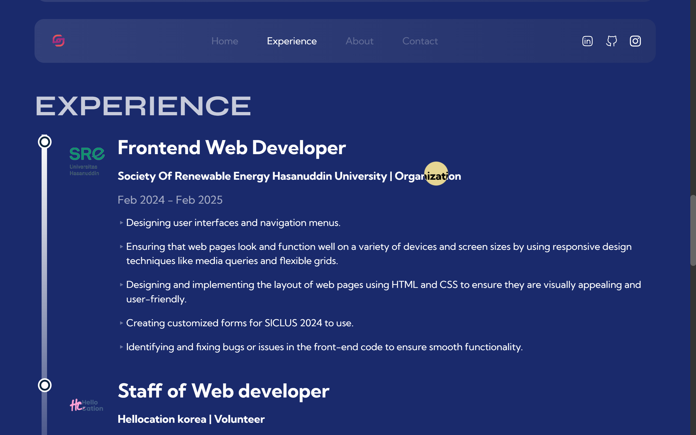
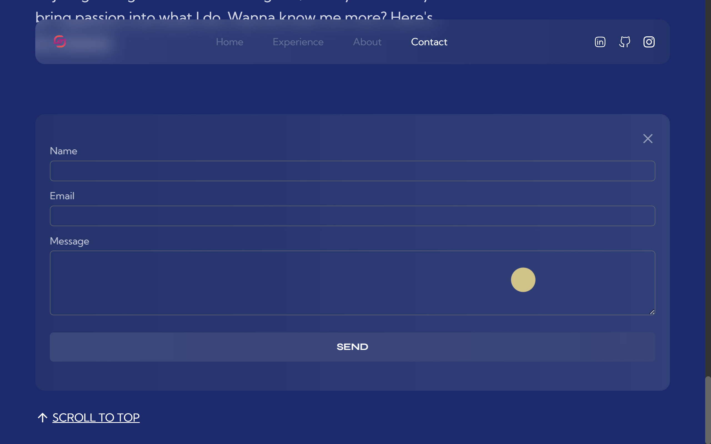

# Portfolio Website — v1

My name is Naufal, a Data Science enthusiast and Web Developer based in Indonesia. I love uncovering patterns in data, building smart solutions, and crafting intuitive web experiences that make technology more accessible and impactful.  

I built this website to showcase my skills in data science and web development while refining my approach to seamless UI/UX design. Throughout this process, I’ve learned valuable insights, and by exploring the code, you might pick up something new too—helping you enhance your own technical skills along the way.

# Tech Stack

Technologies: React, Next.js, Typescript, Tailwind, React-hook-form, Email.js and Framer Motion <br>
Hosting: Netlify

# Gallery



<!--  -->


[View Live Demo](https://dissent.netlify.app/)

# Get started

Clone the project

```
git clone https://github.com/adex-hub/ade-folio.git
```

Go to the project directory

```
cd ade-folio
```

Install dependencies

```
npm install
```

Start the development server

```
npm run dev
```

# Credits  
This design is inspired by the work of **Adeola Badero** ([@Ade_the_great](https://x.com/Ade_the_great)), a talented Frontend Software Engineer & Web Designer. You can check out the original project **[here](https://github.com/adex-hub/ade-folio)**.  

